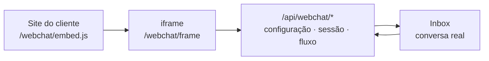
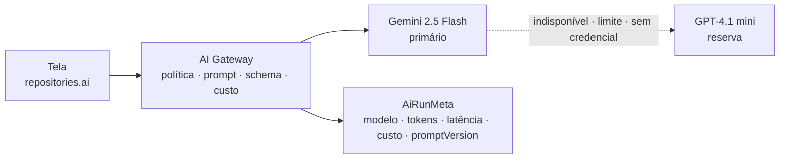

<div align="center">


# Elora

**O elo, agora.**

Plataforma omnichannel da **Contabilidade Facilitada** — atendimento, CRM 360º, automação visual e
inteligência artificial em um só produto.


</div>

---

## Índice

| Seção                                                                | Conteúdo                                             |
| -------------------------------------------------------------------- | ---------------------------------------------------- |
| [O que é a Elora](#o-que-é-a-elora)                                  | posicionamento, origem do nome, fonte da verdade     |
| [Início rápido](#início-rápido)                                      | instalar, subir, variáveis de ambiente, scripts      |
| [Estado atual](#estado-atual)                                        | o que funciona, o que é fronteira, o que é protótipo |
| [Mapa do produto](#mapa-do-produto)                                  | site público e área de trabalho, rota por rota       |
| [O que funciona de verdade](#o-que-funciona-de-verdade)              | webchat, IA, administração, eventos, WhatsApp        |
| [Preço, simulador e demonstrações](#preço-simulador-e-demonstrações) | dois eixos de cobrança, verticais                    |
| [Arquitetura](#arquitetura)                                          | estrutura de pastas, camada de dados, AI Gateway     |
| [Regras que não se negociam](#regras-que-não-se-negociam)            | as sete invariantes do repositório                   |
| [Identidade visual](#identidade-visual)                              | Arena Elora, tokens, movimento, aparência            |
| [Desempenho](#desempenho)                                            | números de referência e como medir                   |
| [Testes](#testes)                                                    | o que está coberto e por quê                         |
| [Roadmap](#roadmap)                                                  | o que falta, em ordem de dependência                 |
| [Documentação e agentes](#documentação-e-agentes)                    | onde está o resto                                    |

---

## O que é a Elora

O mercado vende como quatro produtos separados o que aqui é um só.

| Categoria               | Módulos da Elora                                | O que o mercado cobra em separado    |
| ----------------------- | ----------------------------------------------- | ------------------------------------ |
| Atendimento omnichannel | Inbox, Webchat, WhatsApp, filas e distribuição  | Zendesk, Octadesk, Movidesk, Digisac |
| CRM de relacionamento   | Contatos, Contato 360º, Pipeline, Propostas     | Pipedrive, Ploomes, Agendor, Moskit  |
| Automação de marketing  | Campanhas, Jornadas, E-mail Studio, Automações  | RD Station, HubSpot, Marketing Cloud |
| IA aplicada             | Agentes, Chatbot Builder, copiloto do atendente | Take Blip, Weni, Intercom Fin        |

> **Elora é o produto; Contabilidade Facilitada é a empresa.** Onde o texto é o escritório falando com
> o cliente dele — cabeçalho do widget, rodapé de e-mail, papel do agente de IA —, o nome que aparece
> é o da Contabilidade Facilitada, nunca o da plataforma.

<details>
<summary><strong>Sobre o nome</strong></summary>

<br>

_Elora_ junta **elo** — o vínculo com o cliente, que é a definição de CRM — e **ágora**, a praça grega
onde comércio, deliberação e conversa aconteciam no mesmo lugar. A terminação `-ora` fecha em _agora_,
que é a promessa de qualquer plataforma de atendimento em tempo real. Três camadas em três sílabas, e
nenhuma precisa ser explicada ao usuário.

</details>

**A fonte da verdade do produto é `docs/referencia/plano-completo-crm-v2.txt`** — 35 seções. Antes de
decidir escopo, modelo de dados ou prioridade, localize a seção correspondente e cite-a pelo número.

---

## Início rápido

```bash
pnpm install
cp .env.example .env      # preencha GEMINI_API_KEY para ligar a camada de IA
pnpm dev
```

A aplicação sobe em <http://localhost:3200>.

**Duas entradas convivem, e não são a mesma coisa:**

| Rota      | O que é                                                                                                                       |
| --------- | ----------------------------------------------------------------------------------------------------------------------------- |
| `/`       | landing page do site público                                                                                                  |
| `/entrar` | área do cliente do site — conta com senha, orçamentos salvos e, para a equipe comercial, as bases de demonstração em `/admin` |
| `/login`  | tela de entrada do protótipo do produto — seleção de perfil, sem validação de credencial                                      |
| `/inicio` | onde o produto começa                                                                                                         |

### Variáveis de ambiente

O `.env` fica na **raiz** do repositório, não em `apps/web`: é um valor por repositório, e
`apps/web/next.config.mjs` carrega a raiz para o segredo não existir em dois lugares. Nenhuma variável
de IA usa o prefixo `NEXT_PUBLIC_` — a chave do provedor nunca chega ao navegador.

| Grupo        | Variáveis                                                                                           | Sem elas                                                                           |
| ------------ | --------------------------------------------------------------------------------------------------- | ---------------------------------------------------------------------------------- |
| **IA**       | `GEMINI_API_KEY`, `OPENAI_API_KEY` (reserva)                                                        | a aplicação sobe e os painéis de IA mostram o estado "desligado" em vez de quebrar |
| **WhatsApp** | `WHATSAPP_VERIFY_TOKEN`, `WHATSAPP_APP_SECRET`, `WHATSAPP_ACCESS_TOKEN`, `WHATSAPP_PHONE_NUMBER_ID` | o webhook **recusa tudo** — de propósito                                           |
| **Site**     | `ELORA_ADMIN_EMAIL`, `ELORA_ADMIN_PASSWORD`, `SITE_SESSION_SECRET`                                  | nenhuma conta de administrador é criada e a área de demonstrações não abre         |

Cada variável está comentada em [`.env.example`](.env.example) com o motivo de existir.

### Scripts

| Comando          | O que faz                                                   |
| ---------------- | ----------------------------------------------------------- |
| `pnpm dev`       | servidor de desenvolvimento na porta 3200                   |
| `pnpm typecheck` | `tsc --noEmit` nos três pacotes                             |
| `pnpm lint`      | ESLint, zero avisos tolerados                               |
| `pnpm test`      | Vitest — barramento de eventos, outbox, idempotência, preço |
| `pnpm build`     | build de produção                                           |
| `pnpm format`    | Prettier                                                    |

> [!WARNING]
> **Não rode `pnpm build` com o `pnpm dev` no ar.** Os dois escrevem em `apps/web/.next`, e o build
> substitui artefatos que o servidor de desenvolvimento mantém abertos. O sintoma não parece
> ambiental: metade das rotas passa a responder `Internal Server Error` em texto puro, 21 bytes, sem
> pilha e sem nada no navegador que aponte a causa. A saída é parar o `dev`, apagar `.next` e subir de
> novo. Para medir desempenho com o `dev` de alguém no ar, use `next build --distDir .next-perf`.

> [!TIP]
> **E não canalize o `dev` para `head`.** `pnpm dev | head -n` fecha o cano quando enche, o processo
> recebe SIGPIPE e o servidor morre no meio da primeira compilação — o que se parece com "o Next
> travou compilando o Inbox".

---

## Estado atual

A regra deste repositório é não fingir que algo funciona. O que existe se divide em três camadas.

|     | Camada                                   | O que está aqui                                                                                                                                                                                                                                                                                   |
| :-: | ---------------------------------------- | ------------------------------------------------------------------------------------------------------------------------------------------------------------------------------------------------------------------------------------------------------------------------------------------------- |
| 🟢  | **Funciona de ponta a ponta**            | Webchat (widget no site do cliente → Inbox → resposta do atendente), copiloto do atendente, redação de e-mail por IA, agente de atendimento com ferramentas e avaliação, escrita real na Administração, barramento de eventos com outbox, site público com simulador de preço e conta autenticada |
| 🟡  | **Fronteira pronta, sem persistência**   | Webhook do WhatsApp — verificação e assinatura HMAC validadas de verdade; a mensagem ainda não vira conversa                                                                                                                                                                                      |
| ⚪  | **Front-end sobre base de demonstração** | Todo o resto: Inbox, Contatos, Pipeline, Campanhas, Jornadas, E-mail Studio, Analytics                                                                                                                                                                                                            |

> [!IMPORTANT]
> **Não há back-end, Supabase nem autenticação real do produto.** A camada de escrita de conversas,
> contatos e negócios ainda vive em estado de componente. Isso é o próximo grande bloco de trabalho,
> não um detalhe pendente.

---

## Mapa do produto

### Site público — grupo de rotas `(site)`

Grupo de rotas, e não um segundo Next: o site usa os mesmos tokens, os mesmos componentes e o mesmo
motor de preço que o produto. Dois aplicativos duplicariam o design system e produziriam a divergência
que aparece meses depois, quando o botão da landing page deixa de ser o botão do produto.

| Rota                                | O que faz                                                                            |
| ----------------------------------- | ------------------------------------------------------------------------------------ |
| `/`                                 | landing page, com sete prévias de tela **desenhadas em JSX** — não capturadas        |
| `/precos`                           | tabela por edição e simulador de preço com os dois eixos                             |
| `/orcamento`                        | pedido de proposta, com o cálculo refeito no servidor                                |
| `/entrar` · `/cadastrar` · `/conta` | conta do site: `scrypt` com sal, cookie assinado com vencimento dentro da assinatura |
| `/admin`                            | restrita — bases de demonstração e simulador, em abas                                |

### Área de trabalho — grupo de rotas `(workspace)`

| Tela                  | Rota                                   | O que faz                                                                                                                                                                                                                       |
| --------------------- | -------------------------------------- | ------------------------------------------------------------------------------------------------------------------------------------------------------------------------------------------------------------------------------- |
| **Início**            | `/inicio`                              | fila "precisa de você agora" reunindo SLA em risco, tarefas vencidas, aprovações paradas, execuções com erro e canais degradados; pulso do dia por hora                                                                         |
| **Inbox**             | `/inbox`                               | filas, filtros, busca, SLA com prazo vivo, anexos (arrastar, colar, galeria, áudio com transcrição), notas internas, respostas rápidas, transferência, janela de 24 h do WhatsApp, **copiloto de IA** e **painel de tabulação** |
| **Contatos**          | `/contatos`                            | tabela com busca, filtros, detecção de duplicidade, ações em massa                                                                                                                                                              |
| **Contato 360º**      | `/contatos/[id]`                       | visão geral, linha do tempo filtrável, conversas, negócios, identificadores e consentimentos com base legal                                                                                                                     |
| **Pipeline**          | `/pipeline`                            | kanban com arrastar e soltar, dois funis, valor ponderado, negócios parados                                                                                                                                                     |
| **Campanhas**         | `/campanhas` · `/campanhas/[id]`       | progresso de envio, construtor de segmentos com motivos de exclusão, biblioteca de templates, funil do envio, lotes, teste A/B, proteções e aprovação                                                                           |
| **Automações**        | `/automacoes`                          | regras "aconteceu isto → faça aquilo", com gatilho declarando o evento de domínio que escuta                                                                                                                                    |
| **Chatbot Builder**   | `/chatbots/[id]`                       | editor de blocos, catálogo, inspetor, validação de publicação, versionamento imutável e simulador                                                                                                                               |
| **Journey Builder**   | `/jornadas/[id]`                       | editor de jornada, política de reentrada, janela de envio, participantes com nó atual                                                                                                                                           |
| **E-mail Studio**     | `/email-studio` · `/email-studio/[id]` | templates com métricas, módulos de marca travados, brand kits, entregabilidade (SPF/DKIM/DMARC), montagem por blocos e **redação por IA**                                                                                       |
| **Agentes de IA**     | `/agentes/[id]`                        | instrução, base de conhecimento, ferramentas com allowlist, roteamento, simulador e **conjunto de avaliação executável**                                                                                                        |
| **Webchat**           | `/webchat/[id]`                        | widget configurável com prévia fiel, domínios autorizados, formulário pré-conversa, contraste calculado                                                                                                                         |
| **Analytics**         | `/analytics`                           | atendimento, comercial, campanhas e automação por período, mais o dicionário de métricas                                                                                                                                        |
| **Administração**     | `/administracao`                       | pessoas, times, filas com SLA e distribuição, canais, escalas, catálogos, perfis, política de acesso, aparência e auditoria — **com escrita real**                                                                              |
| **Setup do WhatsApp** | `/administracao/whatsapp`              | as seis etapas separadas por dono, endereço do webhook, variáveis presentes (nunca o valor) e os últimos eventos recebidos                                                                                                      |

---

## O que funciona de verdade

### 🟢 Webchat — o único canal completo hoje



Três coisas que só existem aqui:

1. **Domínios autorizados aplicados pelo navegador.** O trecho de incorporação é público. Conferir o
   cabeçalho `Origin` nas rotas não basta — o widget roda num `iframe` no nosso domínio, então toda
   chamada chega com a nossa origem. A checagem que vale é a diretiva `frame-ancestors` respondida em
   `apps/web/src/middleware.ts`: é o navegador do visitante que se recusa a renderizar num site fora
   da lista.
2. **Contraste calculado contra a página, não contra o rótulo.** Medir só o texto sobre a cor aprova
   qualquer escolha. O que reprova de verdade é a peça contra o branco (WCAG 1.4.11, 3:1).
3. **A prévia não usa token nenhum.** No site do cliente não existe `--primary`; um widget pintado com
   `bg-primary` mudaria junto com o nosso tema e mentiria sobre o resultado.

<details>
<summary><strong>Dois relógios, e misturá-los quebra em silêncio</strong></summary>

<br>

`lastActivityAt` usa o instante ancorado, que é o que a interface exibe; `touchedAtMs` usa
`Date.now()`, que é o que mede tempo decorrido. A primeira versão expirava sessão comparando o carimbo
ancorado com o relógio real — como a âncora fica no passado, toda sessão nascia vencida e sumia na
chamada seguinte.

O runtime de fluxo é **um só**: `packages/core/src/utils/flow-runtime.ts`. O simulador do editor e o
servidor do webchat chamam as mesmas funções, porque duas implementações produziriam a divergência que
mais custa caro num construtor visual — o fluxo aprovado no simulador se comportando de outro jeito na
frente do visitante.

</details>

### 🟢 Inteligência artificial

Tudo passa pelo **AI Gateway**. A tela chama `repositories.ai`, que chama a rota, que é o único lugar
com a credencial, a escolha de modelo, a política, a validação por schema e a medição de custo.



| Recurso                   | Onde                    | O que faz                                                                                                                                                                                          |
| ------------------------- | ----------------------- | -------------------------------------------------------------------------------------------------------------------------------------------------------------------------------------------------- |
| **Copiloto do atendente** | Inbox                   | analisa a conversa (resumo, intenção, sentimento, urgência, próximo passo, checklist, resposta sugerida), responde pergunta livre em fluxo, sugere e melhora rascunho, ajusta tom em sete direções |
| **Tabulação assistida**   | Inbox                   | o copiloto **propõe**, a aplicação **valida** contra o cadastro, a pessoa **grava**                                                                                                                |
| **Redação de e-mail**     | E-mail Studio           | recebe briefing e devolve assunto, preheader, corpo e chamada validados contra schema                                                                                                              |
| **Agente de atendimento** | Agentes                 | laço completo: recebe, decide, usa ferramenta, responde, transfere                                                                                                                                 |
| **Avaliação**             | `/api/ai/agent/avaliar` | executa os casos e pontua por dimensão com verificações determinísticas, atreladas à `promptVersion`                                                                                               |

> **Leitura executa; escrita nunca.** A escrita vira `AgentPendingAction` e espera clique de gente no
> Inbox. O texto que volta ao modelo é redigido com cuidado: a primeira versão dizia "registrado", o
> agente lia como confirmação e escrevia "pronto, já agendei" — promessa que ninguém tinha cumprido.

**Três guardas moram na aplicação, não no prompt**: o piso de confiança vira transferência, a fila
escolhida é validada contra o catálogo (fila inventada cai na padrão) e o teto de custo é por
conversa, conferido antes de gastar. Pedir ao modelo que se autocensure funciona às vezes; conferir
funciona sempre.

<details>
<summary><strong>Por que a reserva é de disponibilidade, nunca de qualidade</strong></summary>

<br>

Só `indisponivel`, `limite_excedido` e `sem_credencial` acionam a reserva. Recusa de conteúdo seria a
mesma dos dois lados, e falha de schema é problema de prompt, que já tem passo de reparo próprio.
Mudar modelo por qualidade é decisão de gente com o conjunto de avaliação da seção 16.4 na mão, não de
um `catch`. `AiRunMeta` registra **quem atendeu**, não quem devia atender.

Três armadilhas ao mexer nisso:

1. **No fluxo, a reserva só vale antes do primeiro byte.** Passado o primeiro trecho, o atendente já
   está lendo; recomeçar em outro provedor reescreveria a tela.
2. **O freio de uso em memória usa `limite_excedido`, que é código de reserva.** Funciona porque a
   rota o chama **antes** de entrar na fila. Movê-lo para dentro transformaria o nosso próprio limite
   em porta de entrada para a OpenAI.
3. **Schema é traduzido, não duplicado.** O formato canônico é o do Gemini; `toStrictSchema` converte
   para o modo estrito da OpenAI, onde não existe campo opcional. Campo opcional **com `enum`**
   quebraria a conversão, porque o `enum` não incluiria `null`.

</details>

### 🟢 Administração — a primeira parte do produto que escreve

`AdminRepository` grava num armazém preso ao `globalThis`, que sobrevive à navegação e ao
recarregamento e morre no reinício. A escrita nasceu no repositório, não em estado de componente, para
que a troca por Supabase não toque nenhuma tela.

- **Toda escrita devolve `AdminWriteResult`, nunca lança.** "É o último administrador" é resposta com
  motivo escrito, mostrado dentro do diálogo — num toast, some antes da leitura terminar.
- **Toda escrita registra auditoria**, dentro do repositório. Não existe caminho de escrita sem rastro.
- **As regras moram em `utils/admin-rules.ts` e são consultadas duas vezes**: a tela pergunta para
  desabilitar o botão, o repositório pergunta antes de gravar. Uma cópia em cada lado produziria o par
  clássico — botão habilitado e escrita recusada.

<details>
<summary><strong>Distribuição de conversas — função pura, e o motivo</strong></summary>

<br>

`utils/distribution.ts` expõe `decideAssignment`, que recebe tudo por parâmetro, não lê relógio e não
sorteia. Roteamento é a regra mais cara de depurar de um CRM de atendimento porque o defeito nunca
vira erro: vira "às vezes cai para a pessoa errada", meses depois, sem passo a passo.

| Decisão                                                     | Motivo                                                                                                         |
| ----------------------------------------------------------- | -------------------------------------------------------------------------------------------------------------- |
| Empate resolve por identificador, nunca por sorteio         | com `Math.random()`, o mesmo estado produziria respostas diferentes e o simulador deixaria de valer como prova |
| `menor_carga` compara ocupação **relativa**                 | quem tem capacidade 10 e seis conversas está mais folgado que quem tem 4 e cinco                               |
| A decisão carrega `excluded`, com o motivo de cada descarte | transforma "a fila está parada" em frase completa                                                              |
| `offline` nunca recebe, em nenhuma configuração             | atribuir a quem não está conectado deixa a conversa parada com aparência de atendida                           |

**O executor ainda não existe, e a tela não finge que existe.** A Administração entrega a configuração
e a prévia; gravar a atribuição e contar o tempo da oferta é da camada de escrita.

</details>

### 🟢 Barramento de eventos

O webhook faz duas coisas: **valida e publica**. Não resolve contato, não abre conversa, não acorda o
agente — isso acontece depois, em outra transação, com retentativa própria.

- **Evento e entrada de outbox são coisas diferentes.** O evento é o fato, imutável. A entrada é a
  intenção de entregar aquele fato a **um** destino, com contador próprio. Um contador no evento faria
  a falha no analytics reprocessar o Inbox, que já tinha entregue.
- **A chave de idempotência vem do provedor, nunca do conteúdo.** Duas pessoas mandando "ok" no mesmo
  minuto gerariam a mesma chave por resumo, e a segunda mensagem sumiria.
- **A deduplicação devolve o evento original, não erro.** Tratar reentrega como falha faria a Meta
  reentregar para sempre.
- **`nextAttemptAt` é o que faz o recuo existir.** Sem ele, a entrada que falha volta na passada
  seguinte e queima as seis tentativas em segundos.

> [!CAUTION]
> `supabase/migrations/0001_fundacao_eventos.sql` **nunca foi executado** — não há Postgres nem CLI do
> Supabase no ambiente onde foi escrito. É artefato para revisão e primeira execução assistida. Rode
> em projeto descartável antes de qualquer coisa.

### 🟡 WhatsApp — fronteira pronta, nada atrás dela

`/api/canais/whatsapp/webhook` faz de verdade as duas coisas que a Meta exige:

| Exigência              | Como é feito                                              | Por que assim                                                                        |
| ---------------------- | --------------------------------------------------------- | ------------------------------------------------------------------------------------ |
| Desafio da verificação | devolvido **em texto puro**                               | JSON ou aspas em volta produzem 200 e a Meta recusa mesmo assim, sem dizer por quê   |
| `X-Hub-Signature-256`  | HMAC sobre o **corpo cru**, comparação em tempo constante | reserializar o JSON parseado muda espaço e ordem de chave, e a assinatura nunca bate |

Sem `WHATSAPP_APP_SECRET`, o webhook recusa tudo: liberar quando a variável está vazia transformaria
esquecê-la em produção num endpoint público que aceita qualquer corpo.

**Erro nosso não vira erro HTTP.** A Meta reentrega o que não recebe 200, e webhook que falha repetido
derruba a qualidade do número. Só assinatura inválida responde 4xx, porque aí não é a Meta chamando.

> [!IMPORTANT]
> **Falta a mensagem virar conversa**: persistência, idempotência por `waMessageId`, fila e worker.
> Não "termine" isso com um `Map` — o do webchat é honesto porque é o nosso widget na nossa máquina;
> aqui é o número da empresa na mão do cliente.

### 🟡 Meta Conversions API — montagem pronta, envio pendente

`apps/web/src/lib/meta/` porta para TypeScript o que `integracao_meta/` especifica em Python: montagem
do evento e normalização com hash SHA-256 do PII, segundo as regras da Meta.

**Só a montagem.** O envio é do consumidor de outbox, porque é lá que existem credencial, retentativa
e fila de erro — e separar as duas coisas é o que torna esta parte testável sem rede. O barramento já
publica `deal.won` e o roteia para `webhook_externo`; a CAPI é exatamente esse consumidor. Negócio
ganho vira `Purchase` de volta para a Meta, e é isso que ensina o algoritmo de anúncio a procurar mais
gente como quem fechou. Sem esse retorno, a Meta otimiza para clique e a conta gasta otimizando a
métrica errada.

`action_source` não é cosmético: manda tudo como `website` — a tentação, porque é o padrão — e uma
venda que o comercial fechou por WhatsApp passa a ser atribuída a anúncio de tráfego.

### Anexos

| Origem      | Situação                                                                                                                  |
| ----------- | ------------------------------------------------------------------------------------------------------------------------- |
| **Link**    | ✅ funciona. `/api/media/preview` resolve tipo, tamanho, título e capa no servidor, inclusive vídeo do YouTube por oEmbed |
| **Arquivo** | ⚠️ não sai do navegador. Vive num `File` em memória com object URL; o caminho real de mídia é trabalho de back-end        |

> [!WARNING]
> **Toda busca de URL informada pelo cliente passa por `lib/net/safe-fetch.ts`**: só http e https, só
> portas 80 e 443, resolução de DNS com todos os endereços conferidos, faixas privadas, loopback,
> link-local e CGNAT bloqueadas, IPv6 expandido byte a byte, e cada salto de redirecionamento
> revalidado. Três rotas dependem dela — prévia de mídia, prévia de site e base de conhecimento dos
> agentes. Afrouxar a validação transforma o servidor em procurador da rede interna.

---

## Preço, simulador e demonstrações

### Dois eixos, e isso é a decisão central

Do **Salesforce** vem a edição por assento; do **RD Station**, a escada por volume. Sozinho, o
primeiro pune operação enxuta de volume alto; o segundo, base grande e adormecida. A Elora cobra os
dois separados — **assinatura + assento + consumo medido**.

| Edição           | Para quem                                        |
| ---------------- | ------------------------------------------------ |
| **Essencial**    | um time, um canal, o básico bem feito            |
| **Profissional** | automação, campanhas e o agente de IA no ar      |
| **Performance**  | volume alto, vários times, governança de verdade |
| **Corporativo**  | colaboradores ilimitados e contrato sob medida   |

A tabela inteira mora em `packages/core/src/pricing/catalog.ts`, e **não há um único número em
`calculator.ts`**: reajustar preço não deveria exigir ler lógica de cálculo.

<details>
<summary><strong>Quatro consequências que valem enunciar</strong></summary>

<br>

1. **Repasse de provedor viaja separado da margem.** A conversa de WhatsApp tem o custo da Meta (sem
   margem) e a taxa da plataforma. O desconto comercial **não incide sobre o repasse**: descontá-lo
   sairia do nosso bolso a cada mensagem, e o prejuízo cresceria justamente com quem mais dispara.
   Coberto por teste.
2. **A escada de contatos é progressiva.** Cada fatia paga o preço da própria faixa. Aplicar o preço
   da faixa final ao total cria o degrau em que cadastrar mil contatos a mais **reduz** a fatura. Há
   teste de monotonicidade.
3. **Colaborador ilimitado existe só na edição de cima.** "Ilimitado" numa edição barata é preço por
   assento escondido num número redondo.
4. **O cálculo roda no navegador e é refeito no servidor.** Os dois lados chamam a **mesma função
   pura** — não existe uma conta "de exibição" e outra "de verdade".

</details>

### Verticais de demonstração

Um **overlay** sobre a base contábil, não um banco paralelo. A vertical reescreve o que carrega
narrativa — organização, times, filas, contatos, conversas, funis, campanhas — e herda o resto.

| Vertical                                       | Base                                                 |
| ---------------------------------------------- | ---------------------------------------------------- |
| **Contabilidade**                              | base original, padrão                                |
| **E-commerce** · **Clínica** · **Imobiliária** | overlays com vocabulário, funis e conversas próprios |

Três famílias de identificador **não mudam** entre verticais — `queue_*`, `chan_*` e as chaves de
habilidade —, porque são citadas por módulos que a vertical não reescreve. Trocá-las deixaria
referências penduradas, e o sintoma seria discreto do pior jeito: nome de fila em branco no meio da
demonstração, sem erro no console.

> [!NOTE]
> **Trocar de vertical vale para a instância inteira**, e por isso a demonstração fica atrás de conta
> de administrador: quem carrega uma base troca os dados de todo mundo. A checagem existe em dois
> lugares — a tela não desenha o botão, e `openVerticalAction` recusa a chamada. Server Action tem
> endereço próprio; um `POST` montado à mão nunca passa pela função que renderiza a página.

---

## Arquitetura

```
elora/
├─ apps/web/                    aplicação Next.js 15 (App Router) + React 19
│  └─ src/
│     ├─ app/(site)/            site público: landing, preços, orçamento, conta, admin
│     ├─ app/(workspace)/       o produto
│     ├─ app/api/               rotas de API
│     ├─ components/            inbox, contacts, pipeline, chatbots, journeys, agents,
│     │                         webchat, admin, flow, site, shell
│     ├─ lib/ai/                AI Gateway — política, prompts versionados, provedores, runtime
│     ├─ lib/webchat/           servidor de sessões do widget
│     ├─ lib/canais/            WhatsApp e cofre de credenciais
│     └─ lib/net/               guarda contra SSRF
├─ packages/
│  ├─ core/                     tipos canônicos, utilitários, repositórios
│  │  ├─ demo/                  verticais de demonstração (overlay sobre a base contábil)
│  │  └─ pricing/               tabela de preços e motor do simulador
│  ├─ ui/                       design system @elora/ui
│  └─ config/                   preset Tailwind compartilhado
├─ supabase/migrations/         fundação de eventos (ainda não executada)
├─ docs/
│  ├─ referencia/               Plano Completo (fonte da verdade)
│  ├─ arquitetura.md            decisões desta onda e o que muda na próxima
│  └─ design-system.md          tokens, componentes e regras visuais
└─ .claude/agents/              doze especialistas mapeados aos papéis da seção 24
```

### Camada de dados

As telas consomem **repositórios**, nunca a origem do dado:

```
ContactRepository · ConversationRepository · DealRepository · AutomationRepository
DirectoryRepository · CampaignRepository · EmailStudioRepository · InsightsRepository
GovernanceRepository · AdminRepository · AiRepository
```

Hoje resolvem para a implementação em memória. Quando o Supabase entrar, muda apenas
`packages/core/src/repositories/index.ts` — nenhuma tela precisa ser reescrita.

`AiRepository` é a exceção: já aponta para o Gateway real. Inteligência não tem versão em memória que
valha algo — uma resposta fixa não ensina nada sobre latência, custo ou qualidade do prompt.

### Base de demonstração

Tudo é fictício e determinístico. Nenhum dado real de contato, mensagem ou documento é usado.

|                                                                                      |                                                                        |
| ------------------------------------------------------------------------------------ | ---------------------------------------------------------------------- |
| 1 organização · 7 usuários · 4 times · 4 filas · 5 contas de canal                   | 26 contatos (com uma duplicidade proposital) · 6 empresas · 10 tags    |
| 16 conversas com histórico, notas internas, anexos e falhas de entrega               | 18 negócios em 2 funis · 8 tarefas                                     |
| 2 chatbots · 2 jornadas · agentes com base de conhecimento e casos de avaliação      | 6 campanhas · 4 segmentos · 6 templates (um reprovado)                 |
| 4 e-mails em blocos · 5 módulos de marca · 2 brand kits · 2 domínios · 10 supressões | séries de 14 dias · pulso por hora · custos · 10 entradas de auditoria |

A fila da página inicial é **derivada** dos demais dados — SLA em risco vem das conversas, aprovações
vêm das campanhas, erros vêm das jornadas. Nada aparece ali sem um evento por trás.

---

## Regras que não se negociam

<table>
<tr><td width="30" align="center">1</td><td>

**Acesso a dados passa por repositório.** A aplicação consome as interfaces de
`packages/core/src/repositories/types.ts`. Se você escrever `fetch` ou cliente Supabase dentro de um
componente de tela, está errado.

</td></tr>
<tr><td align="center">2</td><td>

**IA passa pelo Gateway.** Dois arquivos, e só eles, podem nomear um provedor: `lib/ai/gateway.ts`
(política, prompt, mascaramento, validação) e `lib/ai/providers.ts` (transporte e reserva). Prompt
novo vai em `lib/ai/prompts.ts` **com versão** — e ao mudar o texto, suba a versão, porque é o que
permite atribuir queda de qualidade.

</td></tr>
<tr><td align="center">3</td><td>

**Cor sai de token.** Tudo vem de `packages/ui/src/styles/tokens.css`. Componente não escreve
hexadecimal. Duas exceções com dono único: cores derivadas de dado (informam só a matiz) e marcas de
terceiros (a cor faz parte do glifo, e vive em `lib/brand-icons.tsx`).

</td></tr>
<tr><td align="center">4</td><td>

**Campo usa `border-input`, nunca `border-border`.** Não é estética: limite de componente de interface
tem piso obrigatório de 3:1 pela WCAG 1.4.11.

</td></tr>
<tr><td align="center">5</td><td>

**Tempo é ancorado.** `packages/core/src/utils/datetime.ts` prende tudo a `REFERENCE_NOW_ISO` e ao
fuso `America/Sao_Paulo`. Nunca use `Date.now()`, `new Date()` ou `toLocaleString` sem `timeZone` em
código renderizado — servidor e cliente divergem e a hidratação quebra.

</td></tr>
<tr><td align="center">6</td><td>

**Server Component por padrão.** `"use client"` só onde há interação ou estado. E **toda superfície de
dados tem quatro estados**: vazio, carregando, erro e sucesso.

</td></tr>
<tr><td align="center">7</td><td>

**Multiempresa desde o tipo.** Toda entidade carrega `organizationId`. Quando o back-end entrar, a RLS
valida a associação do usuário à organização.

</td></tr>
</table>

---

## Identidade visual

### Arena Elora

| Papel             | Cor       | HSL           |
| ----------------- | --------- | ------------- |
| Índigo principal  | `#1E1B4B` | `244 47% 20%` |
| Índigo secundário | `#312E81` | `242 48% 34%` |
| Branco            | `#FFFFFF` | superfícies   |
| Âmbar (acento)    | `#DC8F09` | `38 92% 45%`  |

**O símbolo é um anel que não fecha, e a abertura é preenchida pelas três hastes do E** — "elo" e
"Elora" na mesma forma. Vive em `components/shell/logo.tsx`, desenhado em SVG: herda cor de token,
funciona nos dois temas sem segundo arquivo e acompanha a troca de paleta de graça. Não há PNG de
marca no repositório.

Tipografia: **Sora** nos números e títulos de seção, **Inter** na interface. Ambas auto-hospedadas via
`@fontsource` — nenhuma requisição externa.

### Três regras de composição

1. **A borda é exceção — e exceção precisa ser vista.** Superfícies se separam por cor e sombra;
   hairline só onde duas regiões roláveis se encontram.
2. **Um acento por tela.** O âmbar marca o que precisa de ação — não decora.
3. **A tipografia carrega a hierarquia.** Peso e escala antes de cor.

O traço tem piso de contraste medido, não estimado a olho:

| Token             | Contra branco | Onde se usa                                                |
| ----------------- | ------------- | ---------------------------------------------------------- |
| `--border`        | 1,86:1        | hairline estrutural: separador, divisória, moldura de menu |
| `--border-strong` | 2,68:1        | onde a divisão precisa de peso                             |
| `--input`         | **3,41:1**    | limite de componente — WCAG 1.4.11 exige 3:1               |
| `--focus-ring`    | 3,73:1        | indicador de foco — mesma exigência                        |

**O foco não usa `--accent`**: o âmbar rende 2,63:1 contra branco. Serve para preencher botão, onde o
contraste que importa é o do texto sobre ele; não para desenhar um traço de 2 px.

### Aparência configurável

Duas perguntas com donos diferentes. "Qual é a cor desta instalação?" é da organização — numa
plataforma multiempresa a paleta é identidade. "Claro ou escuro? Denso ou espaçado?" é da pessoa.

| Decisão                     | Dono        | Onde grava                                   |
| --------------------------- | ----------- | -------------------------------------------- |
| Paleta da instalação        | Organização | `AdminRepository`, com validação e auditoria |
| Padrões de modo e densidade | Organização | idem                                         |
| Permitir escolha individual | Organização | idem                                         |
| Modo e densidade de cada um | Pessoa      | `localStorage` do navegador                  |

São **quatro paletas** — Índigo (padrão), Petróleo, Grafite e Arena clássica. A troca redefine só os
tokens de marca: semântica (`--success`, `--warning`, `--destructive`) e as seis séries de gráfico
ficam de fora, porque as primeiras significam a mesma coisa em qualquer tema e as segundas foram
validadas para daltonismo. Cada paleta carrega o seu `--focus-ring` acima de 3:1.

<details>
<summary><strong>Por que a paleta é servida e a preferência é do navegador</strong></summary>

<br>

`data-palette` sai do servidor já no HTML; resolvê-la no cliente pintaria a página com a paleta padrão
para repintá-la no primeiro quadro — o flash mais caro possível, porque atinge todos os tokens de uma
vez. Modo e densidade dependem de `localStorage` e de `prefers-color-scheme`, e por isso continuam no
único script inline da aplicação.

**Densidade escala a raiz tipográfica** (15 / 16 / 17 px), e não uma lista de utilitários: o Tailwind
mede espaçamento em `rem`, então padding, gap, altura de linha e texto se movem juntos e na mesma
proporção. Compacto encolhe cada medida em 6,25% — numa lista de conversas, isso devolve uma linha
inteira por tela.

</details>

### O plano da conversa

O Inbox não usa `surface-sunken`: usa `--chat-canvas`, um pergaminho texturizado, com `--chat-in` e
`--chat-out` nas bolhas. O desenho entra como **máscara** — o SVG carrega só a forma, a tinta sai de
`--chat-doodle` —, e é isso que permite a mesma textura servir aos dois temas sem duplicar arquivo e
sem quebrar a regra de que cor sai de token. As bolhas se separam por matiz, não por peso.

### Movimento

Uma orquestração por página, e isso é **aplicado, não recomendado**: toda tela com abas é envolvida por
`<RevealScope>`, que marca a entrada como concluída após 1,2 s. Sem isso, trocar de aba reexecutava a
orquestração inteira — 910 ms de espera para conteúdo que já estava em memória.

**Todo efeito é `transform` ou `opacity`.** Não é preferência estética: o gargalo deste front é
recálculo de estilo e layout, não JavaScript, e animar `width`, `top`, `box-shadow` ou `filter`
acrescenta trabalho exatamente onde já dói.

| Efeito            | O que faz                                   | Como evita layout                                  |
| ----------------- | ------------------------------------------- | -------------------------------------------------- |
| `.sheen`          | brilho atravessa cartão no hover            | pseudo-elemento que desliza, não posição de fundo  |
| `.brand-sheen`    | varredura lenta da marca, a cada 12 s       | idem — e devagar, porque fica visível o tempo todo |
| `.underline-grow` | sublinhado da aba ativa cresce do centro    | `scaleX`, em vez de medir o gatilho e reposicionar |
| `.stagger`        | entrada de linha de lista, 28 ms por índice | o mesmo par `opacity`/`translateY` de `.reveal`    |
| `.glow-pulse`     | halo que respira no que está vivo           | acende uma camada já no tamanho final              |
| `.lift-3d`        | cartão se aproxima no hover                 | `perspective` dentro da própria `transform`        |

**Laço tem de parar em repouso.** `prefers-reduced-motion` leva toda animação ao último quadro, então
o último quadro de cada laço é o estado parado — halo apagado, brilho fora da peça, cubo fechado.
Efeito de `hover` não tem esse recurso, e por isso `.sheen` e `.brand-sheen` são desligados por
completo ali.

**Gráfico segue o método.** As primitivas em `packages/ui/src/components/chart.tsx` já carregam as
regras. A paleta `--chart-1..6` foi validada para daltonismo (ΔE ≥ 8 em pares adjacentes) e contraste
nas duas superfícies — não invente uma sétima cor: dobre em "Outros" ou facete.

---

## Desempenho

Medido em build de produção com **Event Timing** (`processingEnd - processingStart`, isto é, o
trabalho de script — sem a latência de quadro do navegador de teste).

| Interação                   |   Antes |      Depois |
| --------------------------- | ------: | ----------: |
| Trocar de conversa, mediana | 64,1 ms | **15,9 ms** |
| Trocar de conversa, pior    | 76,3 ms | **24,2 ms** |
| Digitar uma tecla, mediana  |  4,0 ms |  **2,1 ms** |
| Digitar uma tecla, pior     | 16,8 ms |  **3,5 ms** |

> [!NOTE]
> **O gargalo deste front não é JavaScript.** Em sete trocas de conversa havia ~300 ms de script
> contra ~800 ms de recálculo de estilo e layout. Antes de memorizar qualquer coisa, tire um perfil e
> olhe `Document::recalcStyle` e `LocalFrameView::UpdateStyleAndLayout` — memorizar componente fora do
> caminho crítico já rendeu 3,5 ms aqui, que é trabalho perdido.

As três mudanças que produziram o ganho:

1. **A conversa não é mais remontada.** `key={selected.id}` destruía e recriava a subárvore inteira a
   cada troca. Se a intenção é só zerar estado, faça num efeito preso ao identificador.
2. **`scrollIntoView` só na navegação por teclado.** Força passe síncrono de layout, e nos cliques o
   item já estava visível.
3. **Contexto do copiloto sob demanda.** Percorrer e ordenar todo o histórico era refeito a cada troca
   para algo que só a chamada ao provedor consome.

**Se uma mudança levar a troca de conversa acima de ~25 ms ou a tecla acima de ~5 ms, algo regrediu.**

---

## Testes

```bash
pnpm test
```

Os testes começam no **barramento de eventos**, de propósito: até ele, o que existia era front — e
front errado aparece na tela. O barramento é a primeira peça cujo defeito é **invisível**.

| Área                  | Arquivo                                            | O que está coberto                                                                                                                             |
| --------------------- | -------------------------------------------------- | ---------------------------------------------------------------------------------------------------------------------------------------------- |
| Barramento de eventos | `repositories/events-memory.test.ts`               | separação entre evento e entrada de outbox, idempotência por chave do provedor, deduplicação que devolve o original, recuo por `nextAttemptAt` |
| Preço                 | `pricing/calculator.test.ts`                       | monotonicidade da escada de contatos, repasse de provedor fora do desconto comercial                                                           |
| Distribuição          | `utils/distribution.test.ts`                       | os cinco modelos, desempate por identificador, ocupação relativa, `offline` nunca recebendo                                                    |
| Escala de atendimento | `utils/schedule.test.ts`                           | faixas no plural, exceções por data, escala ausente respondendo aberto                                                                         |
| Comércio e propostas  | `utils/commerce.test.ts` · `demo/comercio.test.ts` | aritmética em centavos, fotografia do item, overlays sobre a base                                                                              |
| Meta CAPI             | `lib/meta/capi.test.ts` · `hashing.test.ts`        | montagem do evento, normalização e hash do PII, contagem de sinais de correspondência                                                          |

---

## Roadmap

Em ordem de dependência — cada item abaixo depende do anterior.

|       | Bloco                         | O que entra                                                                                                                                                            |
| :---: | ----------------------------- | ---------------------------------------------------------------------------------------------------------------------------------------------------------------------- |
| **1** | **Fundação de back-end**      | Supabase, auth, organizações, RLS, auditoria, event store, outbox, filas, workers, CI/CD e observabilidade. É o que transforma as telas atuais em produto              |
| **2** | **Camada de escrita**         | hoje as mutações de conversa, contato e negócio vivem em estado local do componente. Entram junto com idempotência, outbox e auditoria reais                           |
| **3** | **Executor de distribuição**  | a regra existe e é pura, a configuração grava e a prévia funciona; falta gravar a atribuição, contar o tempo da oferta, passar ao próximo e avançar o cursor da roleta |
| **4** | **WhatsApp de ponta a ponta** | persistência da mensagem, idempotência por `waMessageId`, fila e worker de envio                                                                                       |
| **5** | **Mídia (seção 11)**          | upload, antivírus, armazenamento, expiração, miniatura no servidor e URL assinada. A interface já trata `url` ausente como "processando mídia"                         |
| **6** | **Resto da fase 6**           | RAG com pgvector, controle de cota por organização e histórico de rodadas de avaliação para comparar versões ao longo do tempo                                         |

> [!WARNING]
> **Não "termine" o executor de distribuição com um `setTimeout` no servidor** — oferta expirada
> precisa sobreviver a reinício, o que é fila. Pelo mesmo motivo, não termine o WhatsApp com um `Map`.

---

## Documentação e agentes

| Arquivo                                                                                  | Conteúdo                                                      |
| ---------------------------------------------------------------------------------------- | ------------------------------------------------------------- |
| [`docs/referencia/plano-completo-crm-v2.txt`](docs/referencia/plano-completo-crm-v2.txt) | **Plano Completo** — 35 seções, a fonte da verdade do produto |
| [`docs/arquitetura.md`](docs/arquitetura.md)                                             | decisões desta onda e o que muda na próxima                   |
| [`docs/design-system.md`](docs/design-system.md)                                         | tokens, componentes e regras visuais                          |
| [`CLAUDE.md`](CLAUDE.md)                                                                 | instruções do repositório para trabalho assistido por IA      |

`.claude/agents/` traz **doze especialistas** mapeados aos papéis da seção 24 do plano:

`elora-produto` · `elora-ux` · `elora-frontend` · `elora-backend` · `elora-canais` ·
`elora-builders` · `elora-ia` · `elora-qa` · `elora-dados` · `elora-seguranca` ·
`elora-salesforce` · `elora-revisor`

<div align="center">
<br>

**Elora** — Contabilidade Facilitada

</div>
